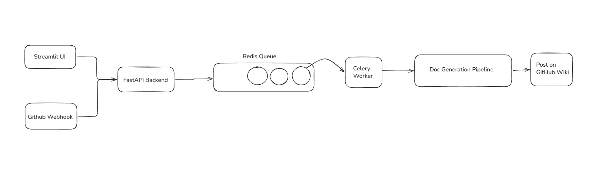

# CoDoc
An agent that automatically analyzes GitHub repositories, understands project architecture using Retrieval-Augmented Generation (RAG), and generates structured technical documentation asynchronously.

Generated documentation can be automatically published to GitHub Wiki pages. Built with a scalable async architecture using Celery + Redis for background processing and Docker for deployment.

## Tech Stack
- FastAPI: webhook endpoints
- Streamlit: frontend dashboard
- Celery: Async job processing
- Redis: Message broker and task queue backend
- Ollama: Runs local LLMs and embedding models
- Chroma: Stores semantic embeddings
- LangChain: Prompting and retrieval pipeline
- nomic-embed-text: Code embedding model
- qwen2.5-coder: Code understanding and documentation generation model

## System Architecture

